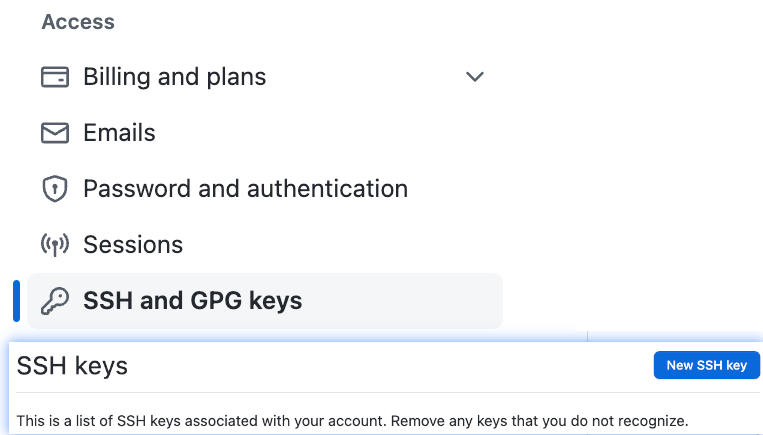

# How to generate and add new ssh key

### Generate ssh key

Paste the text below, replacing the email used in the example with your GitHub email address.

```shell
ssh-keygen -t ed25519 -C "your_email@example.com"
```

**Note:** If you are using a legacy system that doesn't support the Ed25519 algorithm, use:

```shell
 ssh-keygen -t rsa -b 4096 -C "your_email@example.com"
```

### Add ssh key to GitHub

```
cat ~/.ssh/id_xxx.pub
```

Copy the public key to your GitHub > Settings

<figure><figcaption><p>add ssh key</p></figcaption></figure>
